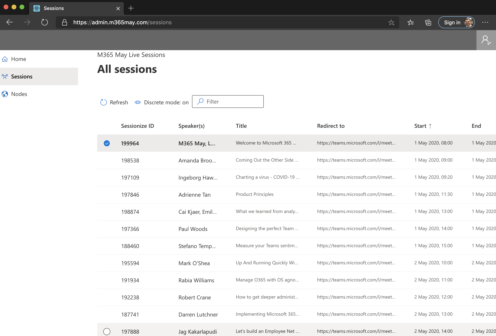

# M365 May Admin

This project is an admin interface used for the [M365 May online event](https://www.m365may.com).  It enables people who are event co-ordinators to update session details.  It was bootstrapped with [Create React App](https://github.com/facebook/create-react-app).

## Pre-requisites

This is one of three repo's used to deliver the M365 May session handling. The other two repo's are:
* [M365 May Client](https://github.com/mpowney/m365may-client) client side code for attendees to browse sessions
* [M365 May API](https://github.com/mpowney/m365may-api) API built as an Azure Function app container to anonymous and authenticated access to data

## Development environment

The development environment of this repo is Node JS - works well with v10.19.0:
* [Node JS v10.19.0](https://nodejs.org/en/blog/release/v10.19.0/)

After cloning or downloading this repo to a local folder, use npm or yarn to install the project dependencies with the command:
```
npm install
```

## Configuration

The following environment variables need to be present at build time to do two things:
* allow the UI to authenticate users via Azure Active Directory
* point to an instance of the [M365 May API](https://github.com/mpowney/m365may-api)

## Development

You can run a local instance of this app, with built-in auto reload capability when files change, with this command:
```
npm run start
```
While this development build is running, any file updated in the project will cause the app to recompile, and changes can be tested in a browser in a matter of seconds.

## Deployment

The built code can be deployed to a static site hosting platform - M365 May deployed the output to an [Azure Static site](https://docs.microsoft.com/en-us/azure/storage/blobs/storage-blob-static-website).  

This [Azure DevOps build YAML file](./pipeline/build.yml) performs the [pipeline steps in Azure DevOps](https://docs.microsoft.com/en-us/azure/devops/pipelines/yaml-schema?view=azure-devops&tabs=schema%2Cparameter-schema) to create build artefacts.  Build artefacts can then be deployed by an Azure DevOps Release pipeline to copy the files to the $web container of the Azure Static site.


## Support

This repo can be used as a reference implementation.  It currently exists as a stand-alone solution for M365 May's needs.  Please contact the author to discuss ways to implement a solution for needs described in [this YouTube video](https://www.youtube.com/watch?v=2IvSCB7xk84&list=PL7_cIERhEJUyVmVRNia1VZXMD5zFGJCuT).

## Screenshot

Here is a screenshot of the admin interface in action: 



## Available Scripts

This project was bootstrapped [with create-react-app](https://create-react-app.dev/).  The default scripts used to develop and deploy the app use ```yarn``` instead of ```npm```.  Below is information on the yarn commands included in create-react-app:

### `yarn start`

Runs the app in the development mode.<br />
Open [http://localhost:3000](http://localhost:3000) to view it in the browser.

The page will reload if you make edits.<br />
You will also see any lint errors in the console.

### `yarn test`

Launches the test runner in the interactive watch mode.<br />
See the section about [running tests](https://facebook.github.io/create-react-app/docs/running-tests) for more information.

### `yarn build`

Builds the app for production to the `build` folder.<br />
It correctly bundles React in production mode and optimizes the build for the best performance.

The build is minified and the filenames include the hashes.<br />
Your app is ready to be deployed!

See the section about [deployment](https://facebook.github.io/create-react-app/docs/deployment) for more information.

### `yarn eject`

**Note: this is a one-way operation. Once you `eject`, you can’t go back!**

If you aren’t satisfied with the build tool and configuration choices, you can `eject` at any time. This command will remove the single build dependency from your project.

Instead, it will copy all the configuration files and the transitive dependencies (webpack, Babel, ESLint, etc) right into your project so you have full control over them. All of the commands except `eject` will still work, but they will point to the copied scripts so you can tweak them. At this point you’re on your own.

You don’t have to ever use `eject`. The curated feature set is suitable for small and middle deployments, and you shouldn’t feel obligated to use this feature. However we understand that this tool wouldn’t be useful if you couldn’t customize it when you are ready for it.

## Learn More

You can learn more in the [Create React App documentation](https://facebook.github.io/create-react-app/docs/getting-started).

To learn React, check out the [React documentation](https://reactjs.org/).
